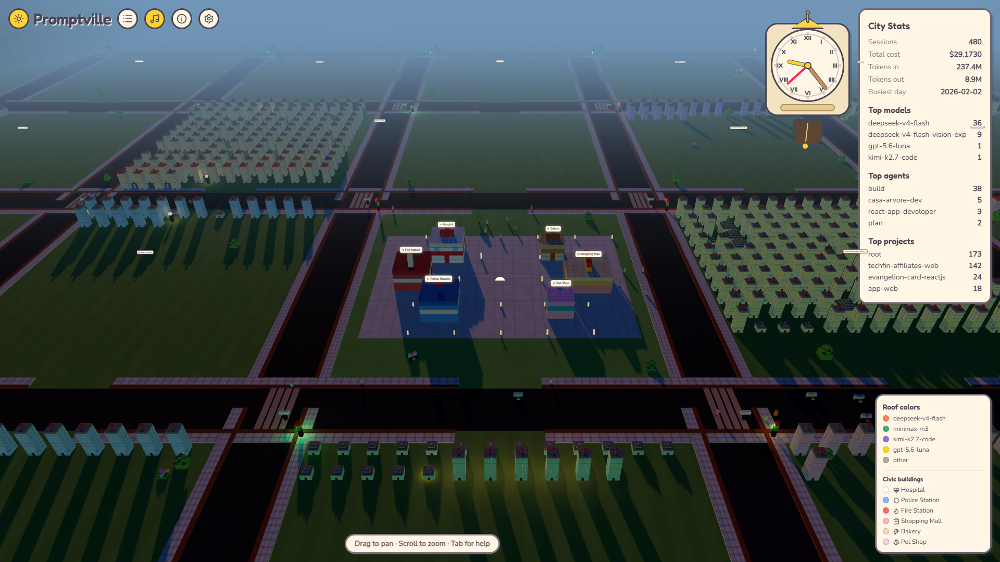
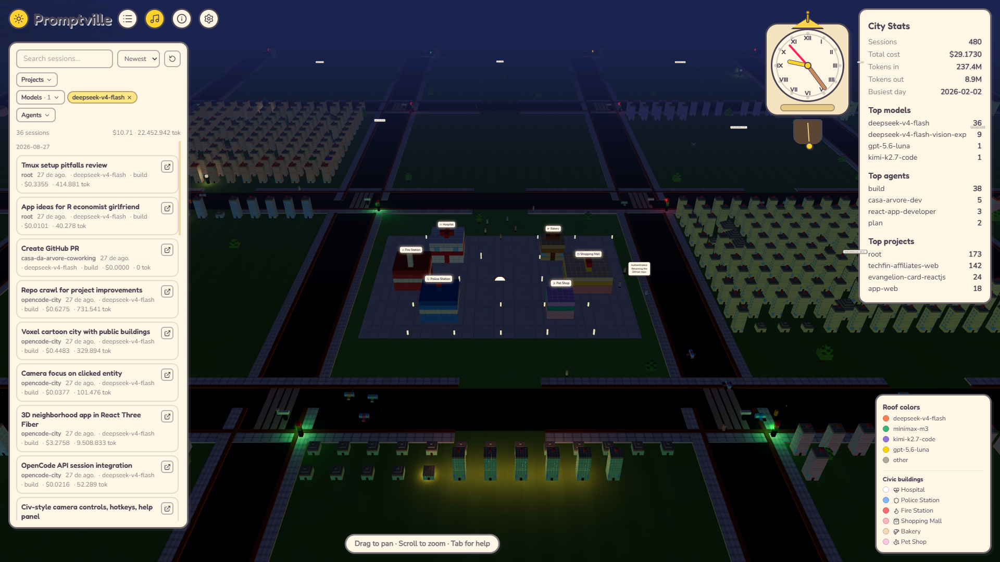
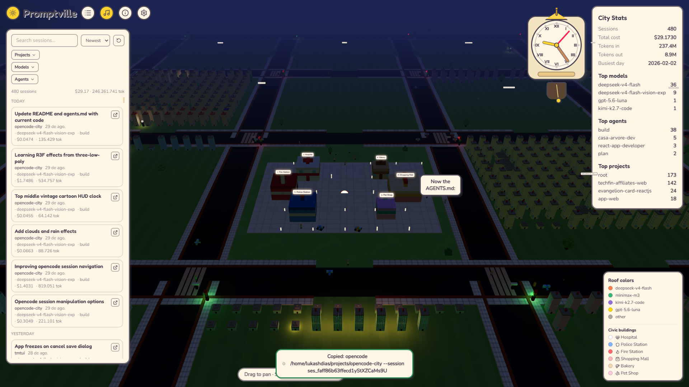
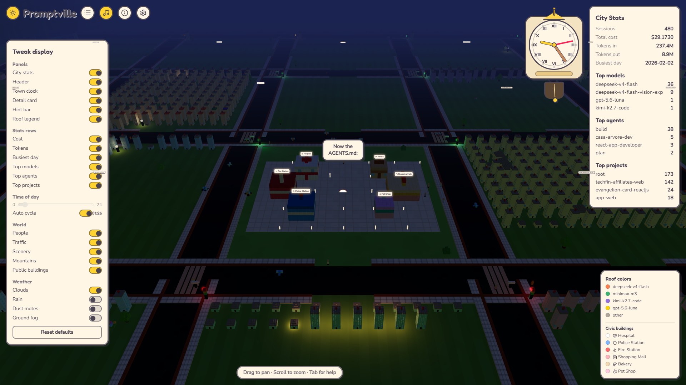
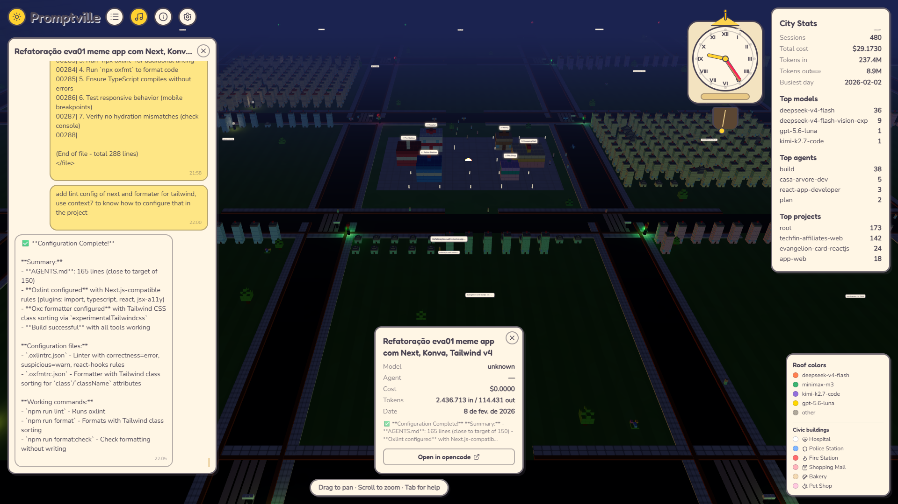

# Promptville

Promptville is a local-only 3D visualization of your opencode history, rendered as a low-poly cartoon toy town. Every opencode **project** becomes a city block; every **session** becomes a house. Houses encode your work at a glance:

- **Height** scales with token usage (bigger house = more tokens)
- **Roof color** encodes the model; the body color identifies the project
- **Layout is deterministic**: projects are ranked by activity (session count, then recency) and placed on a fixed grid around a central plaza — the most active project always occupies the lane north of the plaza. House slots use fixed columns, so adding a session never moves existing houses.
- A cartoon HUD shows aggregate stats: total cost, tokens, top models, top projects.

The scene is built with React Three Fiber and reads the opencode sqlite database **read-only** through a small Bun API server. Data is live from your local database — refresh the page to re-fetch.

## Features

- Procedural low-poly town: street graph with sidewalks and crosswalks, grass lots, an environmental dressing pass (trees, lamps, bushes, flowers), and a mountain ring boundary.
- **Day/night cycle**: sky gradient, sun/moon lighting, warm window and lamp glow at night, moving rain/dust/fog layers, and a clock + auto-cycle toggle.
- **Traffic**: cars and pedestrians flow along the street graph with signal-controlled intersections and crosswalks.
- **Crowd**: NPC clusters on the plaza with speech bubbles whose lines are sourced from real, recent user/assistant messages in your database.
- **Civic district**: public buildings (hospital, police, fire station, mall, bakery, pet shop) with their own visitor and vehicle activity ring.
- **Session navigator**: search, filter (project / model / agent / date), and sort sessions; a chat sidebar shows the selected session's message transcript.
- **Audio**: day/night crossfading soundtrack with a mute toggle and attribution panel; playback starts after an explicit click on the loading splash.
- **Tweak panel**: toggle scene layers (buildings, traffic, people, scenery, clouds, rain, dust, fog, signals, mountains) and choose which stats rows show.
- Interactive houses: hover to highlight, click for a detail card (title, model, agent, cost, tokens, date) with a floating title banner.
- Paper-style HUD: Fredoka + Nunito, pastel palette.
- `frameloop="always"` (the town animates continuously) with shared geometries and instanced voxels.

## Requirements

- Bun ≥ 1.3

## Run

```bash
bun install
bun run dev
```

Open http://localhost:5173. The API reads `~/.local/share/opencode/opencode.db` (falling back to `~/.opencode/opencode.db`) read-only. Point at another database with `OPENCODE_DB_PATH`.

## Scripts

- `bun run dev` — API server (:4100) + Vite (:5173)
- `bun run build` — typecheck + production build (app)
- `bun run typecheck` — both workspaces (server + app)
- `bun test` — server DB/API/parts tests + app logic tests

## Project layout

```
server/   Bun.serve API + Drizzle ORM over bun:sqlite (read-only)
app/      Vite + React 19 + React Three Fiber frontend
docs/     design specs, implementation plans, R3F reference
screenshots/  example captures of the running town
```

## Screenshots

| Capture | Shows |
|---------|-------|
|  | Daytime town: city blocks, plaza, civic buildings, stats panel |
|  | Session navigator open over the night scene |
|  | Crowd bubble called out near the plaza |
|  | Tweak display panel and time-of-day slider |
|  | Chat sidebar and session detail card for a house |

## API

- `GET /api/neighborhood` — stats, projects, and crowd chatter lines
- `GET /api/session/:id` — a session's detail (with a snippet of its latest text)
- `GET /api/session/:id/messages` — the session's message transcript

## Documentation

- Design specs: `docs/superpowers/specs/` (city layout, public buildings, streets, crowd, layered city, day/night, session chat/navigator, camera, ground textures)
- Implementation plans: `docs/superpowers/plans/`
- React Three Fiber patterns used here: `docs/r3f-reference.md`

## Notes

- Reads the opencode database read-only — it never mutates your data.
- Local only by design: no deployment, no auth, no real-time updates.
